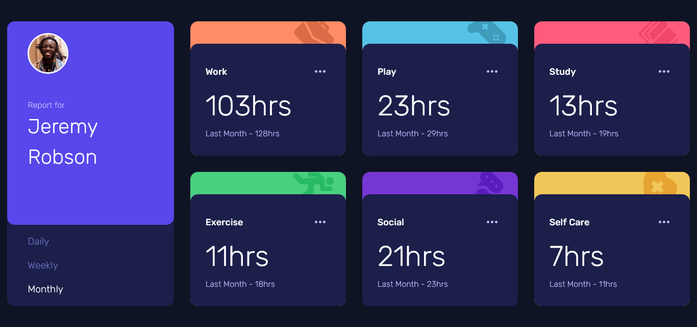

# Frontend Mentor - Time tracking dashboard solution

This is a solution to the [Time tracking dashboard challenge on Frontend Mentor](https://www.frontendmentor.io/challenges/time-tracking-dashboard-UIQ7167Jw).

## Table of contents

- [Overview](#overview)
  - [The challenge](#the-challenge)
  - [Screenshot](#screenshot)
  - [Links](#links)
- [My process](#my-process)
  - [Built with](#built-with)
  - [What I learned](#what-i-learned)
  - [Continued development](#continued-development)
  - [Useful resources](#useful-resources)
- [Author](#author)

## Overview

### The challenge

Users should be able to:

- View the optimal layout for the site depending on their device's screen size
- See hover states for all interactive elements on the page
- Switch between viewing Daily, Weekly, and Monthly stats

### Screenshot



### Links

- Live Site URL: [https://lucasepk.github.io/time-tracking-dashboard/](https://lucasepk.github.io/time-tracking-dashboard/)

## My process

### Built with

- Semantic HTML5 markup
- CSS custom properties
- Flexbox
- CSS Grid
- Mobile-first workflow

### What I learned

About html I learnt about checked property of radio buttons

About CSS I learnt about filter to change svgs colors
```css
.card_img:hover{
    filter: brightness(0) saturate(100%) invert(100%) sepia(64%) saturate(0%) hue-rotate(236deg) brightness(113%) contrast(101%); /*turns svg white*/
}
```

About JS I learnt to retrieve data from a json with fetch and send it to the html

```js
function weekly() { //fetches weekly stats from json and outputs it in the html
    fetch("data.json")
    
    .then(function(response) {
        return response.json();
    })
    
    .then(function(activities) {
        let placeholder = document.querySelector(".json_data");
    
        let out = "";
        let i = 1;
    
        for(let activity of activities){
            
    
            out += `
                <div class="card card-${i}">
                    <div class="card_inside">
                        <h3>${activity.title}</h3>
                        
                        <p class="current">${activity.timeframes.weekly.current}hrs</p>
                        <p class="previous">Last Week - ${activity.timeframes.weekly.previous}hrs</p>
                    </div>
                </div>
            `;
    
            i += 1;
        }
    
        placeholder.innerHTML = out;
    })
}
```

### Continued development

I would really like to get better responsive designs with min and max widths and heights but I can't figure it out for now. I would also like to get more familiar with JS.

### Useful resources

- [https://www.youtube.com/watch?v=eS-FVnhjvEQ](https://www.youtube.com/watch?v=eS-FVnhjvEQ) - Fantastic video about how to put json data into the html using javascript
- [https://www.tutorialspoint.com/how-to-check-whether-a-radio-button-is-selected-with-javascript](https://www.tutorialspoint.com/how-to-check-whether-a-radio-button-is-selected-with-javascript) - Here I learnt about radio button's checked attribute
- [https://stackoverflow.com/questions/22252472/how-can-i-change-the-color-of-an-svg-element](https://stackoverflow.com/questions/22252472/how-can-i-change-the-color-of-an-svg-element) - Here I learnt how to change the color of an svg

## Author

- Frontend Mentor - [@LucasEPK](https://www.frontendmentor.io/profile/LucasEPK)
